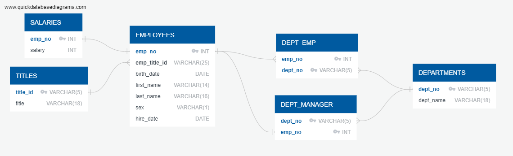

# Employee Database Project

This project sets up an employee database using SQL scripts and includes an Entity-Relationship Diagram (ERD) for visualization. CSV files in the "data" directory have been manually imported into the corresponding tables.

## Contents

- [Summary](#summary)
- [Files](#files)
- [Entity-Relationship Diagram](#entity-relationship-diagram)
- [How to Use](#how-to-use)

## Summary

The project focuses on an employee database with tables for titles, employees, salaries, departments, dept_emp, and dept_manager. Data has been imported from CSV files into the tables, and data analysis queries are provided in `queries.sql` for extracting insights.

## Files

- `schema.sql`: Contains SQL statements to create the database tables.
- `queries.sql`: Contains SQL statements for data analysis.
- `data/`: Directory containing CSV files for manual data import.
- `ERD.png`: Entity-Relationship Diagram illustrating the database structure.

## Entity-Relationship Diagram

The ERD visually represents the relationships between different tables in the database.

## How to Use

1. **Database Setup:**
   - Execute the SQL statements in `schema.sql` in your SQL client to create the database tables.

2. **Data Import:**
   - Manually import CSV files from the `data/` directory into the corresponding tables.

3. **Data Analysis:**
   - Run the SQL queries in `queries.sql` to analyze the data and extract insights.

Feel free to explore the ERD to understand the relationships between tables and use the provided SQL queries for your analysis.

